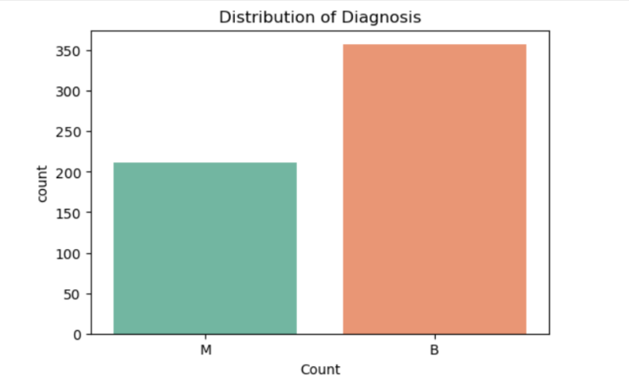
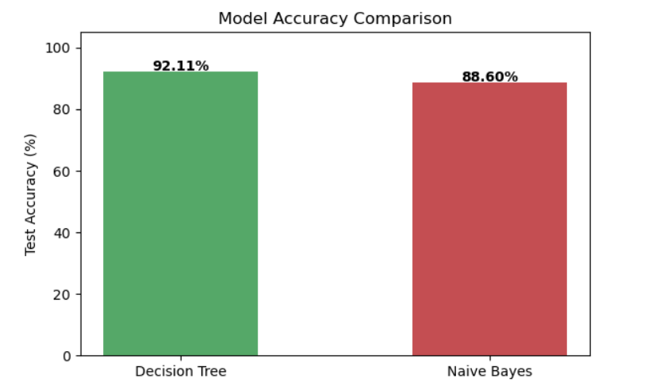
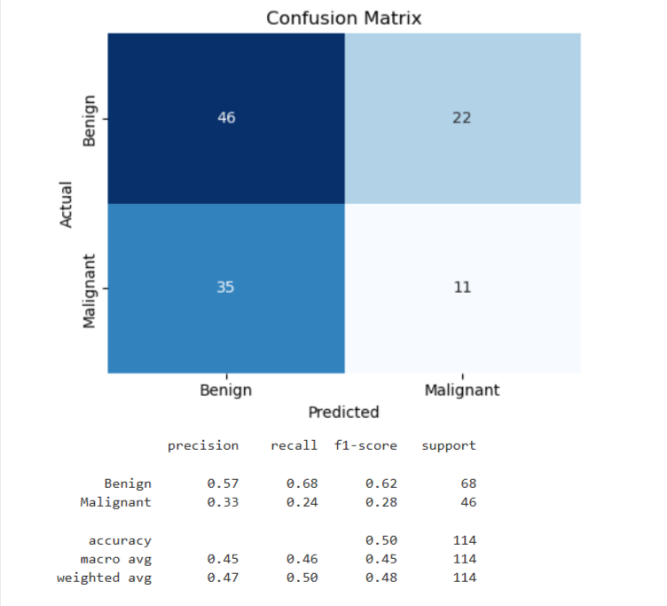
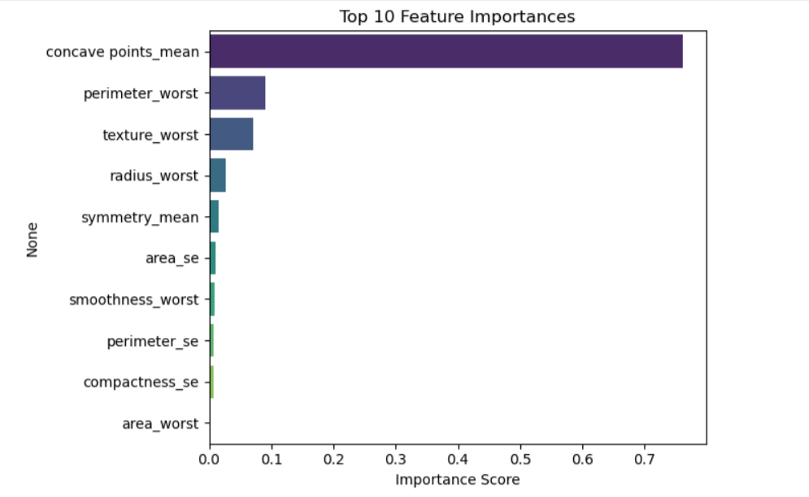
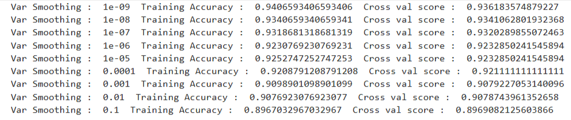

# 🩺 Breast Cancer Prediction — Malignant vs Benign

A machine learning project that predicts whether a breast tumor is **Malignant (M)** or **Benign (B)**
using diagnostic measurements from the Wisconsin Breast Cancer dataset.

---

## 📊 Project Overview

Breast cancer diagnosis relies heavily on the interpretation of cell nuclei characteristics from
biopsy images. This project builds and compares two classification models — **Decision Tree** and
**Gaussian Naive Bayes** — to automatically classify tumors based on 30 numeric features (radius,
texture, perimeter, area, smoothness, concavity, etc.) computed from digitized images of breast mass.

**Dataset:** 569 patient records, 30 features, binary target (`M` = Malignant, `B` = Benign)

---

## 🧠 What Was Implemented

1. **Data Loading & Quality Checks** — loaded the CSV, checked for missing values and dataset shape.
2. **Exploratory Data Analysis (EDA)** — visualized the class distribution of diagnoses (357 Benign / 212 Malignant).
3. **Preprocessing**
   - Encoded target labels: `M → 1`, `B → 0`
   - Dropped the non-predictive `id` column
   - Split data into independent features (`X`) and target (`y`)
4. **Train/Test Split** — 80/20 split, stratified by class to preserve class balance.
5. **Model 1: Decision Tree Classifier** — trained and evaluated on the test set.
6. **Model 2: Gaussian Naive Bayes** — tuned the `var_smoothing` hyperparameter across 9 values
   using 10-fold cross-validation to find the best-performing configuration.
7. **Model Evaluation** — compared test accuracy, generated a confusion matrix, and printed a
   full classification report (precision, recall, F1-score) for the best-performing model.
8. **Feature Importance Analysis** — identified the top 10 most predictive features from the
   Decision Tree model.

---

## 🛠️ Features / Tech Used

| Category | Tools / Libraries |
|---|---|
| Language | Python 3 |
| Data Handling | `pandas`, `numpy` |
| Visualization | `matplotlib`, `seaborn` |
| Machine Learning | `scikit-learn` (DecisionTreeClassifier, GaussianNB, train_test_split, cross_val_score) |
| Evaluation | accuracy_score, confusion_matrix, classification_report |
| Environment | Jupyter Notebook |

---

## 📈 Results

| Model | Test Accuracy |
|---|---|
| Decision Tree | ~92.11% |
| Gaussian Naive Bayes (tuned) | ~88.60% |

The Naive Bayes model, after tuning `var_smoothing`, slightly outperformed the Decision Tree —
achieving **100% precision on Malignant cases**, meaning zero false positives (no benign case wrongly
flagged as cancerous) in this test split, at the cost of missing a small number of malignant cases (recall).

### Visual Results

| Diagnosis Distribution | Model Comparison |
|---|---|
|  |  |

| Confusion Matrix | Feature Importance |
|---|---|
|  |  |



---

## 📁 Project Structure

```
├── data/
│   └── data-cancer.csv          # Wisconsin Breast Cancer dataset
├── images/
│   ├── 01_diagnosis_distribution.png
│   ├── 02_model_accuracy_comparison.png
│   ├── 03_confusion_matrix.png
│   ├── 04_feature_importance.png
│   └── 05_nb_smoothing_tuning.png
├── Code/
   ├── Prediction_cancer.ipynb      # Main analysis notebook
└── README.md
```

---

## ▶️ How to Run

```bash
git clone https://github.com/<your-username>/breast-cancer-prediction.git
cd breast-cancer-prediction
pip install pandas numpy scikit-learn matplotlib seaborn jupyter
jupyter notebook Prediction_cancer.ipynb
```

---

## 🔮 Future Improvements

- Add more models (Random Forest, SVM, Logistic Regression, XGBoost) for broader comparison
- Apply feature scaling/normalization and PCA for dimensionality reduction
- Perform hyperparameter tuning via `GridSearchCV`
- Deploy the best model as a simple web app (Streamlit/Flask) for interactive predictions

---

## ⚠️ Disclaimer

This project is for **educational purposes only** and is not intended for real-world clinical
diagnosis. Always consult a licensed medical professional for actual health decisions.

---

## 📬 Connect

If you found this useful or have suggestions, feel free to open an issue or connect with me on LinkedIn.
