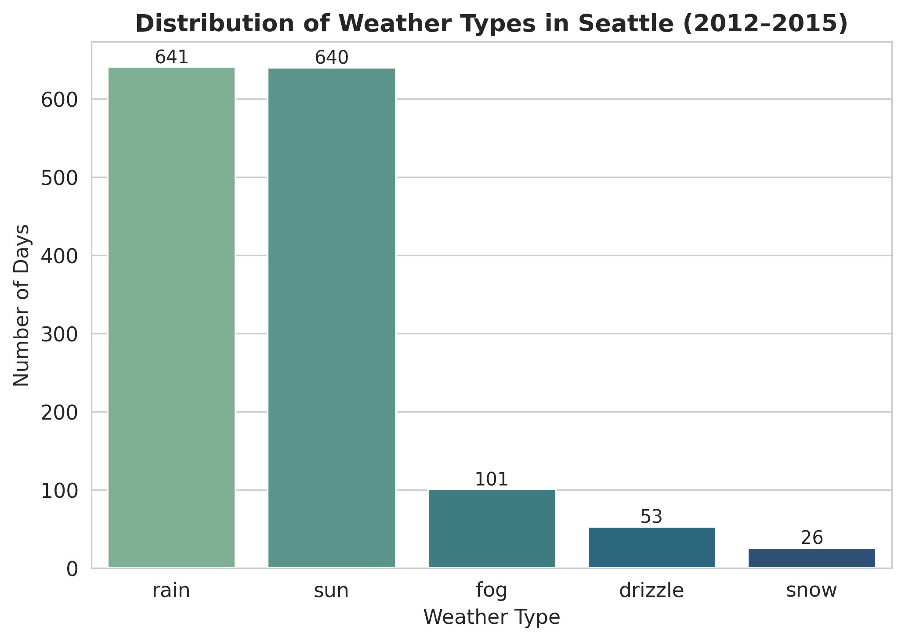
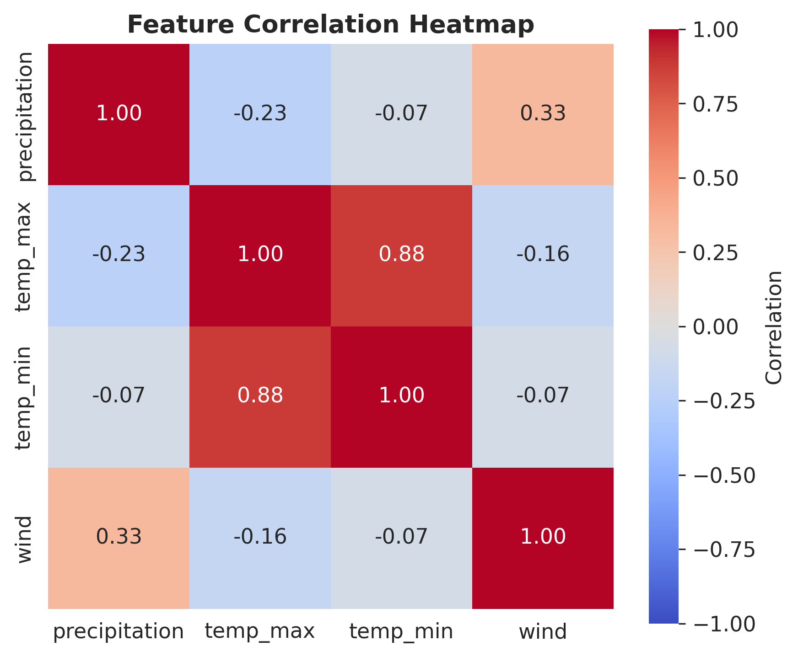
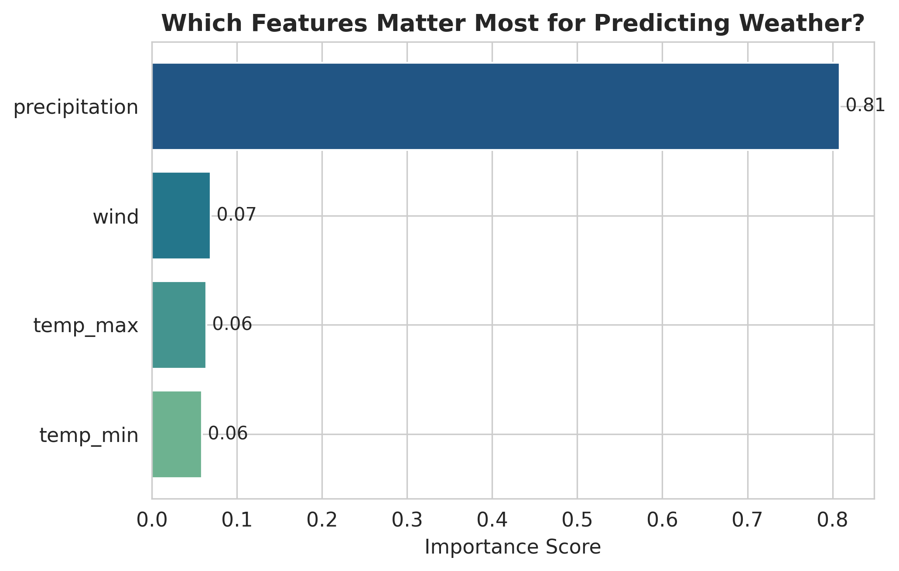
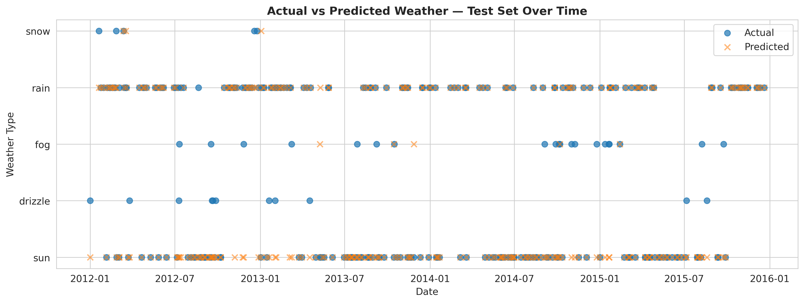

# 🌦️ Seattle Weather Prediction

A machine learning project that predicts the **weather category** (drizzle, rain, sun, snow, or fog) for a given day in Seattle, using historical daily precipitation, temperature, and wind data.


## 📊 Dataset

[`data/seattle-weather.csv`](data/seattle-weather.csv) — 1,461 days of Seattle weather (2012–2015), with:

| Column | Description |
|---|---|
| `date` | Observation date |
| `precipitation` | Precipitation (mm) |
| `temp_max` | Max temperature (°C) |
| `temp_min` | Min temperature (°C) |
| `wind` | Wind speed |
| `weather` | Target label: drizzle / rain / sun / snow / fog |

## 🛠️ What was implemented

- **Data cleaning & preprocessing**: checked for nulls, encoded the categorical `weather` label with `LabelEncoder`, and normalized numeric features (precipitation, temp_max, temp_min, wind) to a 0–1 scale.
- **Train/test split**: 80/20 split, **stratified** on the weather label so rare classes (snow, drizzle) are proportionally represented in both sets.
- **Model**: `GradientBoostingClassifier` (scikit-learn) trained on 4 numeric features.
- **Evaluation**: accuracy, per-class precision/recall/F1 (`classification_report`), and a confusion matrix — evaluated on a **held-out test set** (see "Fix" note below).
- **Model interpretability**: feature importance ranking to see which weather signals matter most.
- **Visualizations**: class distribution, correlation heatmap, feature distributions per weather type, confusion matrix, feature importance, and actual-vs-predicted comparison over time.

### 🐛 Fix vs. the original version
The original notebook evaluated `accuracy_score` on the **training data** the model had already seen, which inflates performance and hides overfitting. This version evaluates on a proper held-out **test set**, giving an honest read on real-world performance:

| Metric | Score |
|---|---|
| Train accuracy | ~91.5% |
| **Test accuracy** | **~83.6%** |

## 🚀 Features / Tech Used

- Python 3
- pandas, numpy — data handling
- scikit-learn — `LabelEncoder`, `train_test_split`, `GradientBoostingClassifier`, metrics
- matplotlib, seaborn — visualization
- Jupyter Notebook

## 📁 Project structure

```
weather-prediction/
├── Weather_Prediction.ipynb   # main notebook: EDA, preprocessing, model, evaluation
├── generate_charts.py         # standalone script that regenerates all chart images
├── data/
│   └── seattle-weather.csv
├── images/                    # exported charts (used in README + LinkedIn post)
├── metrics.txt                # saved accuracy / classification report
├── requirements.txt
└── README.md
```

## ▶️ How to run

```bash
git clone https://github.com/<your-username>/weather-prediction.git
cd weather-prediction
pip install -r requirements.txt
jupyter notebook Weather_Prediction.ipynb
```

## 📈 Key visuals

| | |
|---|---|
|  |  |
|  |  |

## 🔭 Next steps

- Try `XGBClassifier` and compare against `GradientBoostingClassifier`
- Handle class imbalance (very few snow/drizzle days) with class weights or SMOTE
- Add k-fold cross-validation
- Engineer a seasonal feature (month / day-of-year)

## 📄 License

MIT — feel free to use and adapt.
